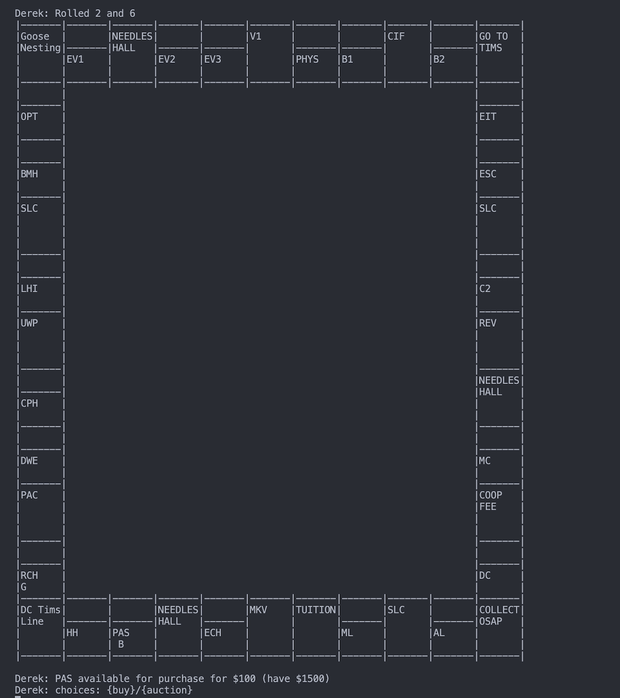

# Watopoly

We built Watopoly for CS246 at the University of Waterloo in Winter 2023. It's a
campus-themed take on Monopoly that runs in the terminal: two to six players
move around a 40-square board, buy buildings, charge tuition, trade, and try to
stay in the game.

The three of us had two weeks to build it in C++14. We wanted the board to feel
like the Waterloo version of the game, with academic buildings, residences,
gyms, and familiar campus stops. Players can improve properties, mortgage them,
auction unclaimed buildings, and save a game to pick up later.

We spent a lot of time on how the pieces fit together. The controller handles
commands and turns, while the game rules live with the board, players, and
squares. The text display watches for changes so it can redraw the board as the
game moves along. Our design changed while we were building it; the documents
below show where we ended up and why.

## Explore the project

- [Project page](index.html) — a quick look at the game and our approach
- [Final design document](design.pdf) — our write-up of the architecture and the decisions we made
- [Final UML diagram](uml-final.pdf) — the class structure behind the game

The implementation isn't included here because of course academic integrity
rules. This page and the design documents are our way of sharing the project
without publishing the source.

## Team

- [Ryan Maxin](https://github.com/Ryanmaxin)
- [Isha Chaudhry](https://github.com/Ishac1)
- [Nandish Patel](https://github.com/nandishofficial)

Watopoly was a CS246 project specified by the University of Waterloo. The game
concept and assignment brief came from the course; the implementation and design
work described here are ours.
